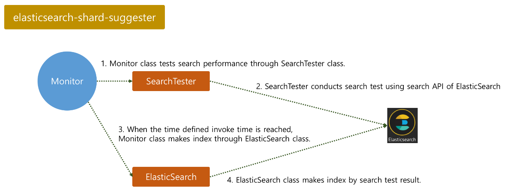

# elasticsearch-shard-suggester

_elasticsearch-shard-suggester_ is a script that suggests the best number of primary shard in the index of next day based on the search performance of the index of today.

## Version
```
0.01
```

## How to run

### 1. Virtual Environment Setting
```
$ git clone git@github.com:kakao/elasticsearch-shard-suggester.git
$ cd elasticsearch-shard-suggester
$ mkdir logs
$ virtualenv venv
$ . venv/bin/activate
(venv) $ pip install -r ./requirements.txt
```

### 2. Supervisord Setting
Below is an example of ini file. If you use different directory, you can modify it to fit the directory you use.
```
[program:elasticsearch-shard-suggester]
command=/usr/local/elasticsearch-shard-suggester/venv/bin/python /usr/local/elasticsearch-shard-suggester/suggester.py
directory=/usr/local/elasticsearch-shard-suggester
killasgroup=true
stopasgroup=true
```

## Configuration
Configuration file is yaml type, you can configure below. 
When installing the first time, you can copy ```conf/elasticsearch-shard-suggester.yml.template``` to ```conf/elasticsearch-shard-suggester.yml```.
```
application:
  invoke_hour: '16'
  query_interval: 60

# detail description of clusters option is below.
clusters:
  - url: elastic-1.cluster.com
    protocol: http
    port: 9200
    timestring: '%Y.%m.%d'
    threshold: 500
    replicas: 1
  - url: elastic-2.cluster.com
    protocol: https
    port: 9200
    timestring: '%Y-%m-%d'
    threshold: 300
    replicas: 1
    username: admin
    password: cGFzc3dvcmQ= #base64 encoded
    basis: yesterday
    shrink: True
    mode: dry_run

logging:
  loglevel: INFO
  logfile: logs/elasticsearch-shard-suggester.log
  format: '[%(levelname)s][%(asctime)s]%(message)s'
```

### cluster configuration details
|Option    |Required|Description|Value Type|
|----------|--------|-----------|-----|
|url       |true    |elasticsearch url to monitor|String|
|protocol  |true    |protocol of elasticsearch url|http or https|
|timestring|true    |index timestring pattern of monitoring|regexp ( ex. %Y.%m.%d)|
|threshold |true    |search performance threshold (ms)|Integer|
|replicas  |true    |number of replicas of index monitored|Integer|
|username  |false   |if you use http basic authentication, type username in this field|String|
|password  |false   |if you use http basic authentication, type password in this field. this value must encoded base64|String|
|basis     |false   |if you want to calculate yesterday's index performance and make today index (today or yesterday)|today or yesterday|
|shrink    |false   |default is False, if this field is set True, elasticsearch-shard-suggester is shrink to index.|True or False|
|mode      |false   |default is None, If this field is setted dry_run, it don't create tomorrow index. But in log file, there's adjusted message|dry_run or blank|

### password encode
```
>>> import base64
>>> base64.b64encode("password")
'cGFzc3dvcmQ=' # use this value in configuration file.
```

## How it works
It has 3 classes. Monitor class is parent class, SearchTester class is performing search to elasticsearch cluster, ElasticSearch class is wrapper class for elasticsearch api.



1) Monitor class tests search performance through SearchTester class.
2) SearchTester conducts search test using search API of ElasticSearch. You can change a query to yours. Default query is below. If you want to change query, you modify core/search_tester.py file. And SearchTester class use ```preference=_shards:0```, so search request is not broadcast, but is carried to a single shard.
3) When the time defined invoke_time in ```conf/elasticsearch-shard-suggester.yml``` is reached, Monitor class makes index through ElasticSearch class.
This is the most important logic from now on.
At this time, Monitor class determines the optimal shards size and the number of shards at that time based on the took_time delivered through the searchtester class.
Suppose today’s index is 500GB in size and consists of 10 shards, so the size of a single shard is 50GB. And if SearchTester class's search test result (last took_time) is 150ms and the threshold on the config is 300ms, the optimal shard size will be 100GB, twice the 50GB. Since the optimal shard size is determined to be 100GB, the tomorrow's index will accumulate 500GB, and eventually 5 shards will be created.
However, if the final calculated number of shards is less than the number of data nodes, the performance can not be guaranteed when a large amount of data is suddenly indexed (ex. burst bulk api), so it is modified to the number of data nodes. However, if you set a ```shrink``` option on the config, the number of data nodes is ignored and set only to the number of shards calculated.
4) ElasticSearch class creates tomorrow's index.

### Default Query
Default query that SearchTester class use is below.
```
{
    "query" : {
        "query_string": {
            "query": "*"
        }
    }
}
```

## License

This software is licensed under the [Apache 2 license](LICENSE.txt), quoted below.

Copyright 2018 Kakao Corp. <http://www.kakaocorp.com>

Licensed under the Apache License, Version 2.0 (the "License"); you may not
use this project except in compliance with the License. You may obtain a copy
of the License at http://www.apache.org/licenses/LICENSE-2.0.

Unless required by applicable law or agreed to in writing, software
distributed under the License is distributed on an "AS IS" BASIS, WITHOUT
WARRANTIES OR CONDITIONS OF ANY KIND, either express or implied. See the
License for the specific language governing permissions and limitations under
the License.